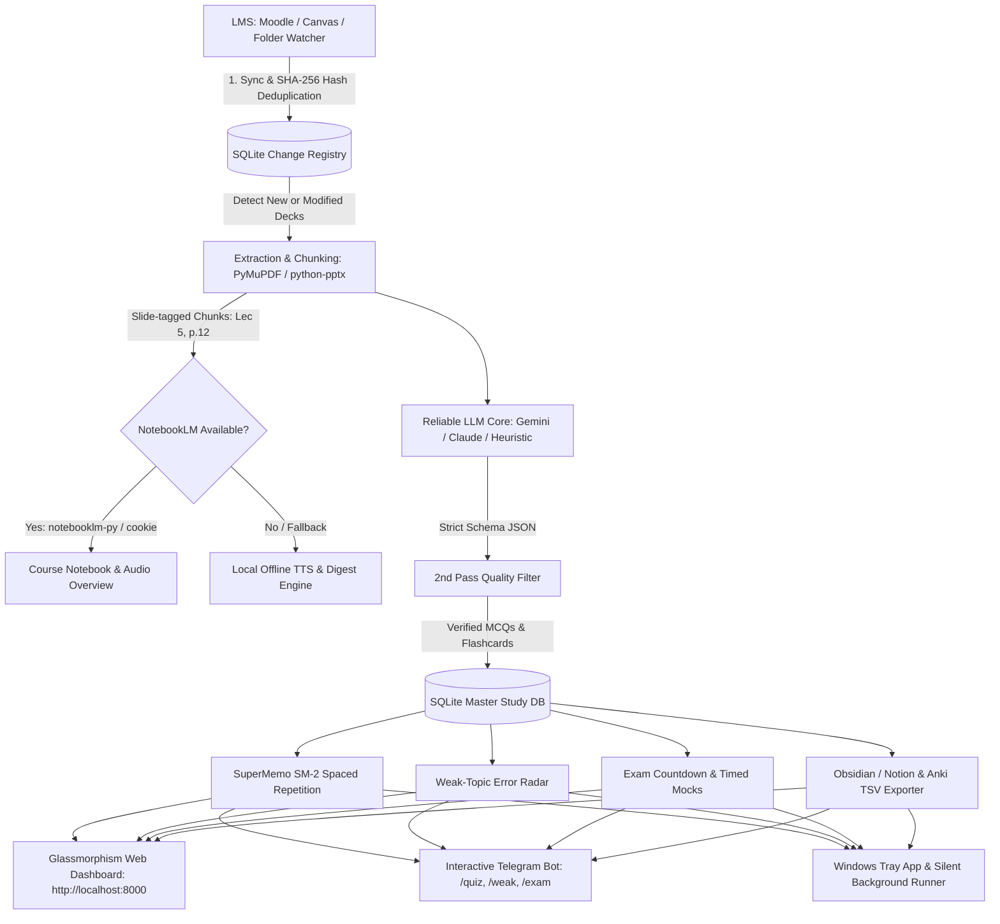

# 🎓 SynapseLMS: Enterprise-Grade Automated Study Operating System
> **LMS Ingestion → Slide Chunking → NotebookLM Optional Layer → Multi-LLM Synthesis → Heuristic Fallback → Quality Filter → SuperMemo SM-2 Spaced Repetition → Glassmorphism Dashboard & Telegram Bot**

[](https://www.python.org/downloads/)
[](https://fastapi.tiangolo.com/)
[](https://sqlite.org/)
[](https://opensource.org/licenses/MIT)

SynapseLMS is an autonomous, local-first study engineering platform tailored for university curricula. It eliminates the fragility of closed proprietary portals and unmaintained scrapers by combining:
1. **Zero-friction ingestion** (Moodle API, Canvas API, or local folder watching).
2. **Deterministic file fingerprinting** with SHA-256 deduplication to prevent repetitive processing.
3. **Multi-tier LLM generation** (Gemini 2.5 Flash / Flash-Lite / Anthropic Claude / Offline Heuristics) with an automated 2nd-pass quality filter.
4. **Cognitive learning science** (SuperMemo SM-2 spaced repetition, weak-topic error radars, and adaptive exam countdown phase shifting).
5. **Multi-client delivery** (FastAPI glassmorphism web dashboard, Windows background tray app, silent autostart, and interactive Telegram bot).

---

## 🏗️ Architecture Pipeline



---

## ✨ Implemented Core Features

### 1. Ingestion & Slide Parsing
- **Moodle & Canvas REST Sync**: Pulls course contents, assignments, lecture modules, and attached slide files automatically.
- **Local Folder Watcher**: Watches `data/lms_downloads/` for manual slide drops (PDF, PPTX, TXT) and catalogs them by course code and week.
- **SHA-256 Hash Fingerprinting**: Prevents redundant LLM token spend by only processing new or modified files.
- **Administrative File Filter**: Automatically filters out course outlines, grading rubrics, exam schedules, and administrative announcements so only actual study slides generate quizzes.
- **Slide-Coordinate Citation**: Every question and flashcard is tagged with exact source slide coordinates (e.g., `Lec 3, Slide 14`), eliminating hallucinations.

### 2. Multi-Model LLM Generation & Quality Assurance
- **Tiered Multi-Model Fallback**:
  1. `gemini-2.5-flash` (Fast, high-fidelity reasoning)
  2. `gemini-flash-lite-latest` (High quota, lightweight)
  3. `claude-3-5-sonnet` (Optional Anthropic fallback)
  4. Local heuristic offline extractor (Zero API cost, regex + NLP based, works offline)
- **2nd-Pass Quality Verification**:
  - Validates that questions have exactly one unambiguous correct answer.
  - Rejects generic boilerplate options (e.g., "All of the above", "None of the above").
  - Ensures option plausibility and enforces strict slide citation constraints.

### 3. Spaced Repetition & Weak-Topic Radar
- **SuperMemo SM-2 Algorithm**:
  - Implements interval progressions, ease factor ($EF \ge 1.3$), and grade ratings (0–5: Blackout to Perfect Recall).
  - Daily review queue prioritizing overdue cards.
- **Weak-Topic Diagnostics**:
  - Tracks running accuracy percentages per course and subtopic.
  - Flags topics with accuracy below 60%.
  - Automatically loads targeted review sessions with 60%+ questions from struggling concepts.

### 4. Exam Countdown & Dynamic Strategy Shifter
- Automatically switches learning modes depending on exam proximity:
  - **Normal Ingestion** (`> 14 days`): Balanced coverage across all topics.
  - **Consolidation** (`7 – 14 days`): SM-2 reinforcement and comprehensive chapter summaries.
  - **High-Yield Cram** (`3 – 7 days`): High-probability topics, formula sheets, and mock tests.
  - **Emergency Revision** (`< 3 days`): High-yield flashcards and formula matrix only.
- **Timed Mock Simulator**: Realistic exam conditions with countdown timers and immediate score breakdowns.

### 5. Automated Exports & Audio Digests
- **Anki TSV Deck Generator**: Direct one-click import into Anki with course tags.
- **Obsidian / Notion Knowledge Base**: Formatted markdown study notes with tables and formulas.
- **One-Page Cheat Sheets**: Markdown definition and formula reference matrices for quick pre-exam scanning.
- **Audio Briefings**: Local TTS synthesis producing 5-minute digest summaries for on-the-go listening.

### 6. Zero-Effort Background Execution
- **System Tray App (`tray_server.py`)**: Runs FastAPI quietly in the Windows system notification area.
- **Silent VBS Launcher (`start_silent.vbs`)**: Launches without opening command prompt windows.
- **Windows Autostart (`install_autostart.bat`)**: Registers SynapseLMS in Windows Startup / Task Scheduler to run on boot.
- **Double-Click Runner (`start.bat`)**: Instant launch and browser opening for manual usage.
- **GitHub Actions Daily Sync (`.github/workflows/study_sync.yml`)**: Cloud-based cron sync running daily at 14:00 UTC (7:00 PM PKT) with Telegram alert notifications.

---

## 🔮 Suggested & Roadmap Features

Here are high-impact enhancements planned for future milestones:

### 1. Vision & Multimodal Diagram Parsing
- **Architecture**: Ingest diagrams, flowcharts, circuits, and mathematical figures using Gemini 2.5 Flash Vision / multimodal embeddings.
- **Value**: Generates visual identification questions (e.g., "Label step 3 in this OSI model diagram").

### 2. Retrieval-Augmented Generation (RAG) & Vector Search
- **Architecture**: Embed lecture slides using `chromadb` or `pgvector` with `text-embedding-004`.
- **Value**: Ask natural language questions in the web UI (e.g., *"How was virtual memory paging explained in lecture 4?"*) with instant jump-to-slide citations.

### 3. Audio / Lecture Video Transcription (Whisper)
- **Architecture**: Ingest Zoom, Teams, or Panopto lecture recordings and transcribe via OpenAI Whisper or local `faster-whisper`.
- **Value**: Correlates what the professor spoke with the corresponding slide content for deep contextual cards.

### 4. Native AnkiConnect Direct Sync
- **Architecture**: HTTP bridge to the AnkiConnect desktop plugin (`http://localhost:8765`).
- **Value**: Eliminates manual `.tsv` export/import; cards sync directly into Anki decks with one button click.

### 5. Collaborative Class Peer Decks & Webhooks
- **Architecture**: Share curated verified decks with classmates via cryptographic export hashes or lightweight peer-to-peer syncing.
- **Value**: Students in the same section pool their verified question banks.

### 6. WhatsApp & Discord Bot Gateways
- **Architecture**: Extend the existing notification engine beyond Telegram to Discord bot webhooks and WhatsApp Cloud API.
- **Value**: Study reminders on whichever messaging app you check most frequently.

---

## 🚀 Quickstart Guide

### 1. Clone & Install Dependencies
```powershell
git clone https://github.com/zorof1226-hash/synapse-lms.git
cd synapse-lms
pip install -r requirements.txt
```

### 2. Configure Environment (Optional)
Copy `.env.example` to `.env`:
```powershell
copy .env.example .env
```
Fill in your API keys (Gemini, Telegram Bot Token, Moodle Token).
*Note: If no API keys are provided, SynapseLMS runs entirely offline using its local heuristic extraction engine.*

### 3. Launching the System

#### Option A: Background Auto-start (Recommended)
Double-click `install_autostart.bat` or run:
```powershell
wscript.exe start_silent.vbs
```
This runs the background tray app without terminal windows.

#### Option B: Double-Click Launcher
Double-click `start.bat` in File Explorer.

#### Option C: Command Line
```powershell
python main.py run
```
Open **[http://127.0.0.1:8000](http://127.0.0.1:8000)** in your browser.

---

## 💻 CLI Commands Reference

| Command | Action |
|---|---|
| `python main.py run` | Start the FastAPI web dashboard on `http://127.0.0.1:8000` |
| `python main.py sync` | Fetch new files from Moodle / Canvas / watched directory |
| `python main.py generate` | Run extraction, LLM/heuristic generation, and quality filter |
| `python main.py seed` | Populate mock data (Operating Systems & Algorithms) for instant demo |
| `python main.py scheduler` | Start background daily 7 PM & weekend cron runner |
| `python main.py bot` | Start interactive Telegram study bot |

---

## 📁 Repository Structure

```
systemmm/
├── main.py                   # Master CLI runner (run, sync, generate, scheduler, bot, seed)
├── config.py                 # Central configurations, file paths & thresholds
├── pipeline.py               # Orchestrator tying LMS, extraction, LLM, SM-2 & exports
├── tray_server.py            # Windows System Tray taskbar process
├── start.bat                 # Double-click server & browser launcher
├── start_silent.vbs          # Zero-window background launcher
├── install_autostart.bat     # Windows Task Scheduler startup registration script
├── requirements.txt          # Python dependencies
├── .env.example              # Environment variables template
├── db/
│   └── database.py           # SQLite schemas, file hashing, SM-2 updates, and quiz logs
├── lms_sync/
│   ├── folder_watcher.py     # Local folder tree change detection & SHA-256 hashing
│   ├── moodle_sync.py        # Moodle core_course_get_contents client
│   └── canvas_sync.py        # Canvas REST API client (modules, files, assignments)
├── extraction/
│   ├── extractor.py          # PyMuPDF + python-pptx chunking with slide citations
│   └── textbook_matcher.py   # Textbook chapter splitter & lecture-to-book matcher
├── notebooklm/
│   └── notebooklm_client.py  # NotebookLM optional wrapper & audio overview fallback
├── generation/
│   ├── llm_generator.py      # Strict JSON generation (Gemini 2.5 Flash / Claude / Offline)
│   └── quality_filter.py     # 2nd pass verification for ambiguity & single correct answer
├── repetition/
│   ├── sm2.py                # SuperMemo SM-2 spaced repetition algorithm
│   ├── weak_tracker.py       # Topic accuracy tracking & weekend quiz generator
│   ├── anki_exporter.py      # Anki TSV and Obsidian/Notion markdown exporter
│   └── cheat_sheet.py        # 1-page formula & definition matrix generator
├── exam/
│   └── exam_engine.py        # Countdown phase tracker, timed mock simulator, deadlines
├── scheduler/
│   └── cron_scheduler.py     # Daily 7 PM & weekend cron runner
├── bot/
│   └── telegram_bot.py       # Telegram bot with inline keyboard quizzes
├── web/
│   ├── server.py             # FastAPI REST endpoints & static file server
│   └── static/               # Glassmorphic UI (HTML5, Vanilla CSS, JS)
└── data/
    ├── lms_downloads/        # Downloaded lecture decks
    ├── audio_digests/        # Synthesized audio briefings (.wav)
    ├── exports/              # Markdown notes & Anki TSV files
    └── study_system.db       # Persistent SQLite database
```

---

## 🔒 Security & Privacy

- **Local First**: All slides, extracted chunks, flashcards, and student quiz history reside in your local SQLite database (`data/study_system.db`).
- **No Telemetry**: No user tracking or telemetry data is sent to external servers.
- **Token Safety**: API credentials in `.env` are excluded from Git commits via `.gitignore`.
