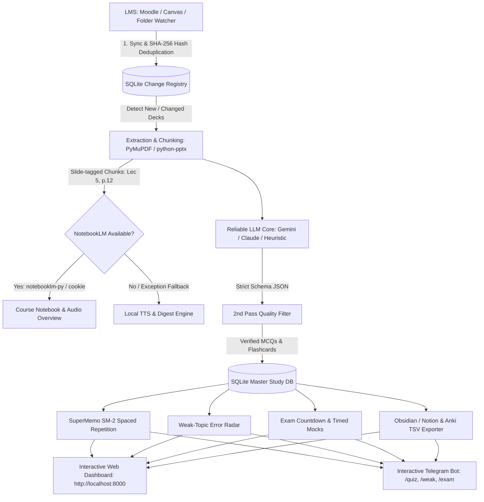

# 🎓 SynapseLMS: Automated Study System
> **LMS → Slide Chunking → NotebookLM (Optional) → Reliable LLM Core → Spaced Repetition → Web Dashboard & Telegram Bot**

SynapseLMS is an end-to-end, resilient study automation pipeline engineered specifically for university students. It solves the fragility of unofficial third-party scrapers and private NotebookLM APIs by treating NotebookLM as an **optional enhancement layer** (for audio overviews and grounding) while keeping the daily core engine completely reliable and local using SQLite, PyMuPDF, python-pptx, and structured LLM APIs.

---

## 🏗️ Architecture Pipeline



---

## ✨ Features Built to Make It Truly Useful

1. **Change Detection with SQLite Hash Fingerprinting**:
   - Computes SHA-256 hashes of every PDF, PPTX, or text file.
   - Only processes new or modified lecture slides, preventing redundant API calls and study duplication.

2. **Slide-by-Slide Tagging & Hallucination Prevention**:
   - Slides and chapters are chunked and tagged with exact coordinates (`Lec 5, Slide 12`).
   - Every MCQ and short-answer question cites its exact slide source.

3. **SuperMemo SM-2 Spaced Repetition**:
   - Calculates recall quality (0–5), ease factor ($EF \ge 1.3$), interval progressions, and due dates.
   - Interactive 3D flip-card review interface.

4. **Weak-Topic Tracking & Targeted Weekend Quizzes**:
   - Logs every answer attempt per topic.
   - Saturday/Sunday quizzes automatically pull 60% of questions from your lowest-accuracy topics.

5. **Exam Countdown & Study Phase Shifter**:
   - Automatically categorizes study mode based on exam dates:
     - `NORMAL_INGESTION` (> 14 days)
     - `CONSOLIDATION` (7–14 days)
     - `HIGH_YIELD_CRAM` (3–7 days)
     - `EMERGENCY_REVISION` (< 3 days)
   - Timed mock exam simulation under realistic pressure.

6. **"Explain Like I'm Stuck" Engine**:
   - If you get a question wrong, one click generates an intuitive 5-year-old style breakdown and a real-world analogy.

7. **Universal Backups & Anti-Lock-In**:
   - Auto-generates **Anki-compatible TSV** files with deck tags.
   - Auto-generates **Obsidian / Notion Markdown** knowledge bases.

8. **Audio Digest Studio**:
   - Produces a 5-minute daily audio briefing summarizing today's lectures and core terms.

9. **Cheat-Sheet Generator**:
   - Compiles definitions, formulas, theorems, and complexities into a clean 1-page markdown reference sheet.

---

## 🚀 Quickstart Guide

### 1. Installation
```powershell
pip install -r requirements.txt
```

### 2. Configure Environment (Optional)
Copy `.env.example` to `.env`:
```powershell
cp .env.example .env
```
*Note: If no API keys are configured, the pipeline runs its high-fidelity offline heuristic extraction engine out of the box!*

### 3. Launch the Web Dashboard
```powershell
python main.py run
```
Open **[http://127.0.0.1:8000](http://127.0.0.1:8000)** in your browser.

### 4. Seed or Ingest Lectures
- **Instant Demo**: Run `python main.py seed` to populate sample Operating Systems and Algorithms lectures with upcoming exams.
- **Ingest Slides**: Drop your slides into `data/lms_downloads/<Course_Code>/Week_XX/` or click **"Ingest Slides"** directly in the web UI.

### 5. Run the Automated Scheduler
```powershell
python main.py scheduler
```
- Daily 7:00 PM sync & material generation.
- Saturday & Sunday targeted weak-topic diagnostic quizzes.

### 6. Interactive Telegram Bot
```powershell
python main.py bot
```
Commands available on Telegram:
- `/quiz [course]` - Instant inline MCQ with citations
- `/weak` - Weak topic accuracy breakdown
- `/exam` - Countdown & strategy phases
- `/weekend` - 15-question diagnostic review

---

## 📁 Repository Structure
```
systemmm/
├── main.py                   # Master CLI runner (run, sync, generate, scheduler, bot, seed)
├── config.py                 # Central configurations & file paths
├── pipeline.py               # Orchestrator tying LMS, extraction, LLM, SM-2 & exports
├── requirements.txt          # Python dependencies
├── .env.example              # Environment variables template
├── db/
│   └── database.py           # SQLite schemas, file hashing, SM-2 updates, and quiz logs
├── lms_sync/
│   ├── folder_watcher.py     # Local folder tree change detection
│   ├── moodle_sync.py        # Moodle core_course_get_contents client
│   └── canvas_sync.py        # Canvas REST API client (modules, files, assignments)
├── extraction/
│   ├── extractor.py          # PyMuPDF + python-pptx chunking with slide citations
│   └── textbook_matcher.py   # Textbook chapter splitter & lecture-to-book matcher
├── notebooklm/
│   └── notebooklm_client.py  # NotebookLM optional wrapper & audio overview fallback
├── generation/
│   ├── llm_generator.py      # Strict JSON generation (Gemini / Claude / Offline)
│   └── quality_filter.py     # 2nd pass verification for ambiguity & single correct answer
├── repetition/
│   ├── sm2.py                # SuperMemo SM-2 spaced repetition algorithm
│   ├── weak_tracker.py       # Topic accuracy tracking & weekend quiz generator
│   ├── anki_exporter.py      # Anki TSV and Obsidian/Notion markdown exporter
│   └── cheat_sheet.py        # 1-page formula & definition matrix generator
├── exam/
│   └── exam_engine.py        # Countdown phase tracker, timed mock simulator, deadlines
├── scheduler/
│   └── cron_scheduler.py     # Daily 7 PM & weekend cron runner
├── bot/
│   └── telegram_bot.py       # Telegram bot with inline keyboard quizzes
├── web/
│   ├── server.py             # FastAPI REST endpoints & static file server
│   └── static/               # Glassmorphic UI (HTML5, Vanilla CSS, JS)
└── data/
    ├── lms_downloads/        # Downloaded lecture decks
    ├── audio_digests/        # Synthesized audio briefings (.wav)
    ├── exports/              # Markdown notes & Anki TSV files
    └── study_system.db       # Persistent SQLite database
```
